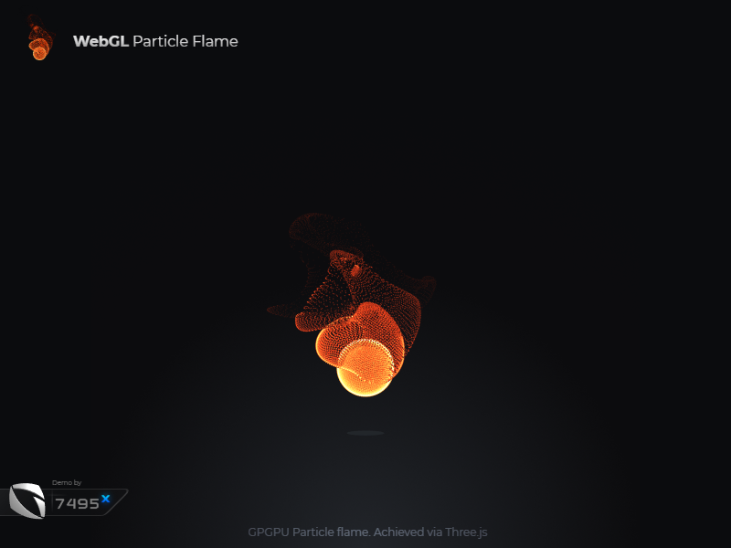
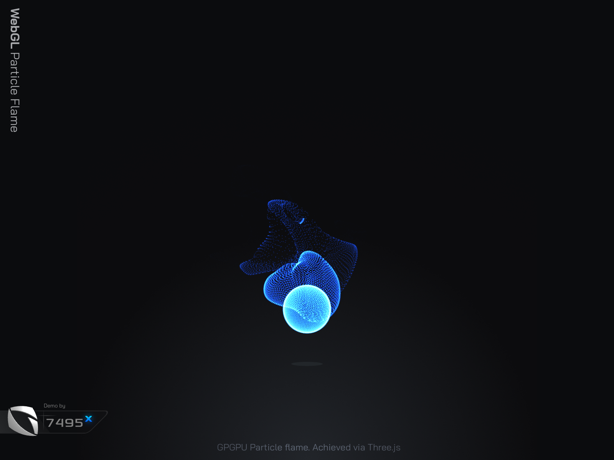

# WebGL Particle Flame - Three.js

GPGPU Particle flame using Curl over Value Noise.
Achieved via Three.js in WebGL.

Highlights:
- GPGPU via GPUComputationRenderer.js
- Procedurally generated
- 4D Curl Noise over Value Noise
- Fully GPU Optimized
- Fully Customizable via URL Params

Demo - [g7495x.github.io/WebGL-Particle-Flame---Three.js/src](https://g7495x.github.io/WebGL-Particle-Flame---Three.js/src/)

Demo with Controls - [g7495x.github.io/WebGL-Particle-Flame---Three.js/src/?showControls=true](https://g7495x.github.io/WebGL-Particle-Flame---Three.js/src/?showControls=true)

Blue Flame - [g7495x.github.io/WebGL-Particle-Flame---Three.js/src/?spherePointCount=3072&color=blue&emitFrequency=2](https://g7495x.github.io/WebGL-Particle-Flame---Three.js/src/?spherePointCount=3072&color=blue&emitFrequency=2)

HQ Flame - [g7495x.github.io/WebGL-Particle-Flame---Three.js/src/?spherePointCount=5120&particleOpacity=.75](https://g7495x.github.io/WebGL-Particle-Flame---Three.js/src/?spherePointCount=5120&particleOpacity=.75)

HQ Blue Flame - [g7495x.github.io/WebGL-Particle-Flame---Three.js/src/?spherePointCount=5120&color=blue&particleOpacity=.75](https://g7495x.github.io/WebGL-Particle-Flame---Three.js/src/?spherePointCount=5120&color=blue&particleOpacity=.75)

To run: `npm start`

